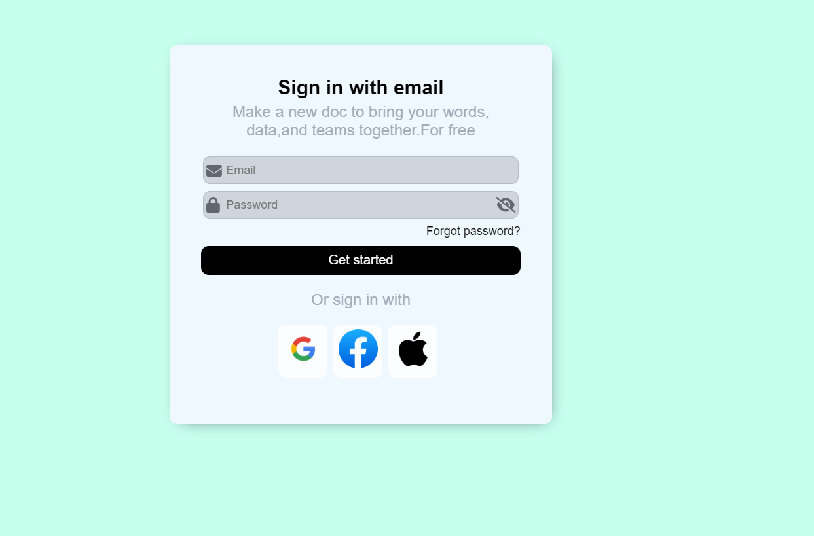

# Login Page Design

This repository contains a Login Page designed using HTML and CSS. The design includes a simple form where users can sign in using their email and password, as well as options to sign in with Google, Facebook, or Apple.


## Features

- Email and Password input fields: Includes a password visibility toggle option.
- Forgot password link: Users can retrieve their forgotten password.
- Third-party login options: Buttons for logging in via Google, Facebook, and Apple.
- Simple UI: A clean and minimal user interface for easy navigation.


## Technologies Used
 - HTML: For creating the structure of the login form.
 - CSS: For styling the form, including input fields, buttons, and overall layout.

## Usage/Examples

```Clone the repository:
Clone the repo :
git clone https://github.com/your-username/your-repo-name.git

Navigate to the project folder:
cd your-repo-name

Open index.html in your browser to view the login page.

```


## Screenshots




